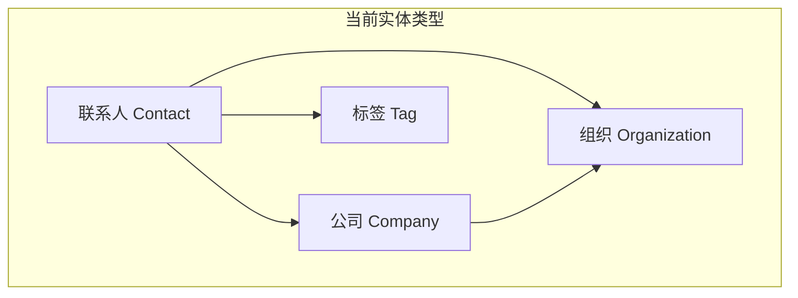
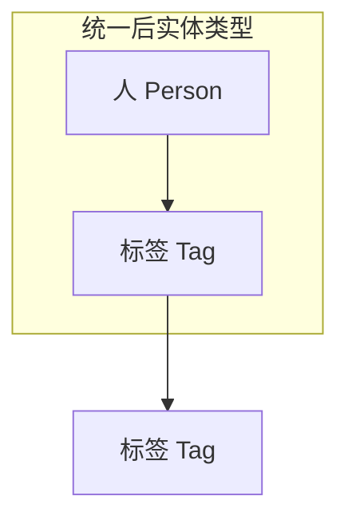

# 实体统一重构技术架构文档

## 1. 架构设计

### 1.1 重构目标
将现有的公司(companies)、组织(organizations)、标签(tags)统一为"标签"概念，简化数据模型为"人"和"标签"两种实体类型。

### 1.2 架构对比

**当前架构：**


**目标架构：**


## 2. 技术描述

- 前端：React@18 + D3.js + tailwindcss@3 + vite
- 后端：无（静态文件系统）
- 数据存储：JSON文件

## 3. 数据结构重构计划

### 3.1 现有数据文件分析

**当前文件结构：**
- `contacts.json` - 联系人数据
- `companies.json` - 公司数据
- `organizations.json` - 组织数据
- `tags.json` - 标签数据

**目标文件结构：**
- `persons.json` - 人员数据（原contacts.json重命名并简化）
- `tags.json` - 统一标签数据（合并companies、organizations、tags）

### 3.2 新数据模型设计

#### 3.2.1 人员数据模型 (persons.json)
```json
{
  "_id": "string",
  "name": "string",
  "email": "string",
  "phone": "string",
  "description": "string",
  "avatar": "string",
  "tags": ["tag_id1", "tag_id2"],
  "created_at": "ISO_date",
  "updated_at": "ISO_date"
}
```

#### 3.2.2 标签数据模型 (tags.json)
```json
{
  "_id": "string",
  "name": "string",
  "description": "string",
  "type": "company|organization|skill|industry|location|custom",
  "color": "string",
  "parent_tags": ["tag_id1", "tag_id2"],
  "child_tags": ["tag_id1", "tag_id2"],
  "connection_count": "number",
  "created_at": "ISO_date",
  "updated_at": "ISO_date"
}
```

### 3.3 数据迁移映射

| 原实体类型 | 新标签类型 | 迁移规则 |
|-----------|-----------|----------|
| Company | company | 保留所有字段，添加type="company" |
| Organization | organization | 保留所有字段，添加type="organization" |
| Tag | skill/custom | 根据内容判断类型 |
| Contact.companies | 关联关系 | 转换为person.tags关联 |
| Contact.organizations | 关联关系 | 转换为person.tags关联 |

## 4. 代码重构计划

### 4.1 核心函数修改

#### 4.1.1 数据加载函数 (loadData)
```javascript
// 修改前：加载4个文件
const [contacts, companies, organizations, tags] = await Promise.all([
  fetch('./data/contacts.json').then(r => r.json()),
  fetch('./data/companies.json').then(r => r.json()),
  fetch('./data/organizations.json').then(r => r.json()),
  fetch('./data/tags.json').then(r => r.json())
]);

// 修改后：加载2个文件
const [persons, tags] = await Promise.all([
  fetch('./data/persons.json').then(r => r.json()),
  fetch('./data/tags.json').then(r => r.json())
]);
```

#### 4.1.2 图谱数据创建函数 (createGraphData)
```javascript
// 修改前：处理4种实体类型
function createGraphData(contacts, companies, organizations, tags) {
  // 复杂的实体类型判断和链接创建
}

// 修改后：处理2种实体类型
function createGraphData(persons, tags) {
  const nodes = [];
  const links = [];
  
  // 添加标签节点（动态大小）
  tags.forEach(tag => {
    nodes.push({
      id: tag._id,
      name: tag.name,
      type: 'tag',
      subtype: tag.type,
      size: calculateTagSize(tag.connection_count),
      color: getTagColor(tag.type),
      ...tag
    });
  });
  
  // 添加人员节点
  persons.forEach(person => {
    nodes.push({
      id: person._id,
      name: person.name,
      type: 'person',
      size: 15,
      ...person
    });
    
    // 创建人员-标签链接
    person.tags?.forEach(tagId => {
      links.push({
        source: person._id,
        target: tagId,
        type: 'person-tag'
      });
    });
  });
  
  // 创建标签-标签链接
  tags.forEach(tag => {
    tag.parent_tags?.forEach(parentId => {
      links.push({
        source: tag._id,
        target: parentId,
        type: 'tag-tag'
      });
    });
  });
  
  return { nodes, links };
}
```

#### 4.1.3 标签大小计算函数
```javascript
function calculateTagSize(connectionCount) {
  const minSize = 8;
  const maxSize = 30;
  const baseSize = 12;
  
  if (!connectionCount || connectionCount === 0) return baseSize;
  
  // 对数缩放，避免大标签过于突出
  const scaledSize = baseSize + Math.log(connectionCount + 1) * 3;
  return Math.min(Math.max(scaledSize, minSize), maxSize);
}
```

### 4.2 节点渲染逻辑修改

#### 4.2.1 节点类型判断简化
```javascript
// 修改前：复杂的类型判断
if (d.type === 'contact' || d.type === 'freelancer') {
  // 人员渲染逻辑
} else if (d.type === 'company') {
  // 公司渲染逻辑
} else if (d.type === 'organization') {
  // 组织渲染逻辑
} else if (d.type === 'tag') {
  // 标签渲染逻辑
}

// 修改后：简化的类型判断
if (d.type === 'person') {
  // 人员渲染逻辑（保持头像功能）
} else if (d.type === 'tag') {
  // 统一标签渲染逻辑（根据subtype调整样式）
}
```

#### 4.2.2 标签颜色方案
```javascript
function getTagColor(tagType) {
  const colorMap = {
    company: '#3B82F6',      // 蓝色
    organization: '#10B981',  // 绿色
    skill: '#F59E0B',        // 橙色
    industry: '#8B5CF6',     // 紫色
    location: '#EF4444',     // 红色
    custom: '#6B7280'        // 灰色
  };
  return colorMap[tagType] || colorMap.custom;
}
```

## 5. 实施步骤

### 5.1 阶段一：数据迁移准备
1. **备份现有数据**
   - 创建 `data/backup/` 目录
   - 备份所有现有JSON文件

2. **创建迁移脚本**
   - `scripts/migrate-data.js` - 数据迁移主脚本
   - `scripts/validate-migration.js` - 迁移结果验证

### 5.2 阶段二：数据结构重构
1. **生成新数据文件**
   - 执行迁移脚本生成 `persons.json`
   - 合并生成新的 `tags.json`
   - 计算标签连接数量

2. **数据完整性验证**
   - 验证所有关联关系正确迁移
   - 检查数据一致性

### 5.3 阶段三：代码重构
1. **核心函数重构**
   - 修改 `loadData()` 函数
   - 重写 `createGraphData()` 函数
   - 更新节点渲染逻辑

2. **UI组件更新**
   - 更新添加/编辑表单
   - 修改搜索和筛选逻辑
   - 调整详情面板显示

### 5.4 阶段四：功能优化
1. **动态标签大小**
   - 实现标签大小计算算法
   - 添加标签重要性视觉指示

2. **交互优化**
   - 标签层级关系可视化
   - 改进拖拽和选择体验

## 6. 测试计划

### 6.1 数据迁移测试
- [ ] 验证所有联系人正确迁移为人员
- [ ] 验证所有公司/组织正确转换为标签
- [ ] 验证关联关系完整性
- [ ] 验证数据计数准确性

### 6.2 功能测试
- [ ] 图谱正确显示人员和标签节点
- [ ] 标签大小根据连接数动态调整
- [ ] 节点交互功能正常
- [ ] 搜索和筛选功能正常

### 6.3 性能测试
- [ ] 大数据量下的渲染性能
- [ ] 内存使用优化验证
- [ ] 交互响应速度测试

## 7. 风险评估与应对

### 7.1 主要风险
1. **数据丢失风险**
   - 应对：完整备份 + 分步迁移 + 验证机制

2. **性能下降风险**
   - 应对：优化算法 + 渐进式加载 + 缓存机制

3. **用户体验变化**
   - 应对：保持核心交互不变 + 渐进式UI更新

### 7.2 回滚计划
- 保留原始数据文件备份
- 提供一键回滚脚本
- 分阶段实施，每阶段可独立回滚

## 8. 预期收益

### 8.1 架构简化
- 实体类型从4种减少到2种
- 代码复杂度降低约40%
- 维护成本显著降低

### 8.2 功能增强
- 标签系统更加灵活
- 支持标签层级关系
- 视觉重要性指示

### 8.3 扩展性提升
- 新标签类型易于添加
- 关系模型更加通用
- 未来功能扩展更容易

---

**文档版本：** 1.0  
**创建日期：** 2024年1月  
**最后更新：** 2024年1月